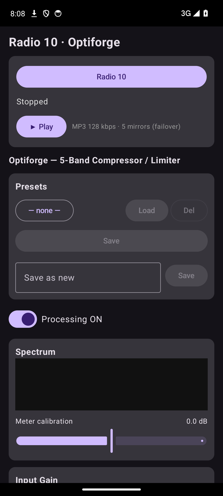

# Radio 10 Optiforge

  

Android MP3 player for **Radio 10** (NL) with a built-in **Optiforge** 5-band
multiband compressor + limiter running live on the stream. Listen to Radio 10
through a real mastering chain — tune the sound to your headphones, car, or speaker.

<em>Kotlin · Jetpack Compose · no NDK · one APK</em>

<strong>Latest: v1.0.1</strong>

## Features

- **Radio 10** — Talpa stream via StreamTheWorld, 128 kbps MP3, with automatic
  mirror **failover**: the primary URL is the load-balancing livestream-redirect
  endpoint, backed by concrete edge nodes; on a stream error the player advances
  to the next mirror and wraps around, so a dead node never stops audio.
- **Optiforge DSP** — `android.media.audiofx.DynamicsProcessing` (API 28+) attached
  to the player's audio session:
  - 5-band multiband compressor (crossovers 150 / 600 / 2500 / 7000 Hz)
  - output limiter + input gain
  - live spectrum analyser and per-band gain-reduction meters (Visualizer tap —
    needs mic permission; processing still works without it)
- **Presets** — save/load named presets. The active preset and all settings
  persist across app switches and restarts; **Save** updates the active preset in
  place, **Save as new** creates another.
- **Background playback** — foreground `PlaybackService` with a single stable audio
  session (so the DSP stays attached across reconnects), a notification with a Stop
  action, and a wake lock.
- **Landscape + tablet** — rotation handled in-place (no state loss).

## Install

Grab the latest signed APK from the [**Releases**](../../releases) page and
sideload it (enable *Install unknown apps* for your browser/file manager).
Minimum Android 10 (API 29).

## Build

    ./gradlew assembleDebug        # debug APK
    ./gradlew assembleRelease \    # signed release (supply your own keystore)
      -PRELEASE_STORE_FILE=/path/to/keystore.jks \
      -PRELEASE_STORE_PASSWORD=... \
      -PRELEASE_KEY_ALIAS=... \
      -PRELEASE_KEY_PASSWORD=...

Toolchain: AGP 8.6.1 · Kotlin 1.9.24 · Gradle 8.9 · compileSdk 35 · minSdk 29 ·
targetSdk 34.

## Credits

Optiforge DSP core reused from the Optiforge-Max multiband compressor app.
Radio 10 is a Talpa Network station — this is an unofficial third-party client.
